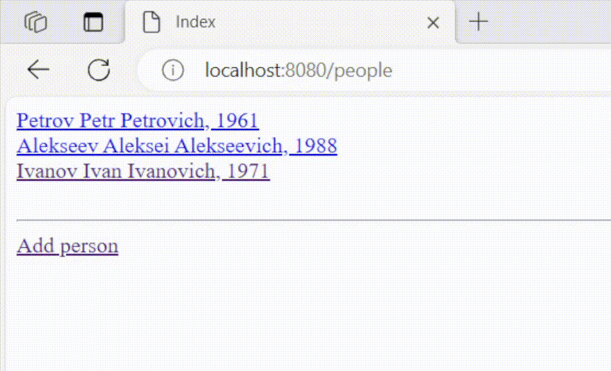
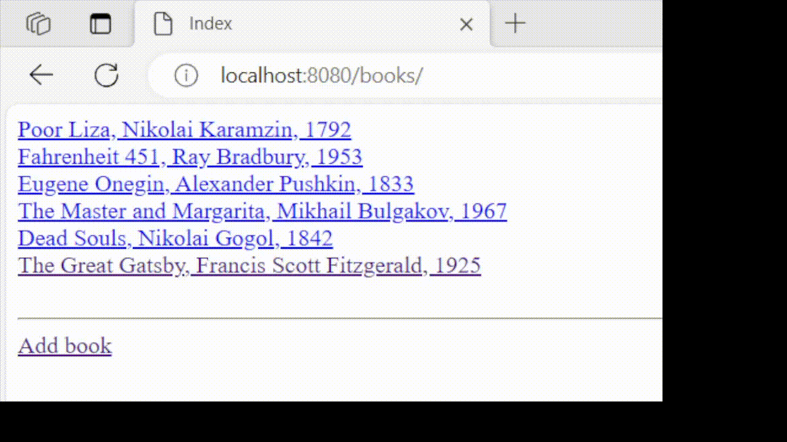

# Library project
___
## Requirements:

__You need to create a web application for the library with the following functionality:__

1. CRUD pages for a person
2. CRUD pages for a books
3. A page listing all people (each person must have a name and an age)
4. A page listing all books (each book must have a title, an author's name and a publication date)
5. User page, which shows information about the user and the books they have taken
6. Book page, which shows information about the book and details about the person who borrowed it
7. All fields must be validated using @Valid and Spring Validator, if required

___
## How to run:

To run the application, Tomcat 9 is used. In IntelliJ IDEA, you need to go to "Run" -> "Edit Configurations" and add a "Tomcat Local Server" with the URL http://localhost:8080/. In the "Deploy" tab, add an artifact.

You also need to add your database configuration in the file "database.properties.origin" and rename the file by removing the ".origin" extension.

___
## Technology stack:

Java 11, Maven, Tomcat, JDBC Template, PostgreSQL, Spring Core, Spring MVC, Hibernate Validator, Thymeleaf, HTML.

___

## Pages: 
__People page:__

__Books page:__

